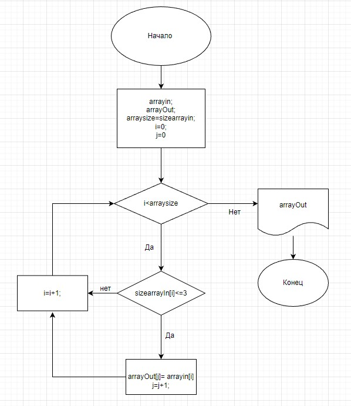

Контрольная работа

ЗАДАЧА:
Написать программу, которая из имеющегося массива строк формирует массив из строк, длина которых меньше либо равна 3 символа.

Первоначальный массив можно ввести с клавиатуры, либо задать на старте выполнения алгоритма. При решении не рекомендуется пользоваться коллекциями, лучше обойтись исключительно массивами.

ПРИМЕРЫ:
["hello”, "2", "world”,-> ["2”] ["1234”, ”1567", ”-2”, "computer science"] -> ["-2"] ["Russia”, "Denmark", "Kazan"] -> []

Нарисовать блок-схему алгоритма 
Написать программу, решающую поставленную задачу
Использовать контроль версий в работе над этим небольшим проектом 
Создать репозиторий на GitHub
Снабдить репозиторий оформленным текстовым описанием решения (файл README.md)
_______________________________________________________________________________

ДЕКОМПОЗИЦИЯ ЗАДАЧИ:

Первоначальный массив задан на старте выполнения алгоритма
подсчет размера выходного массива и создание его
заполнение нового массива -основная часть. (блок-схема на нее)
вывод на экран 

